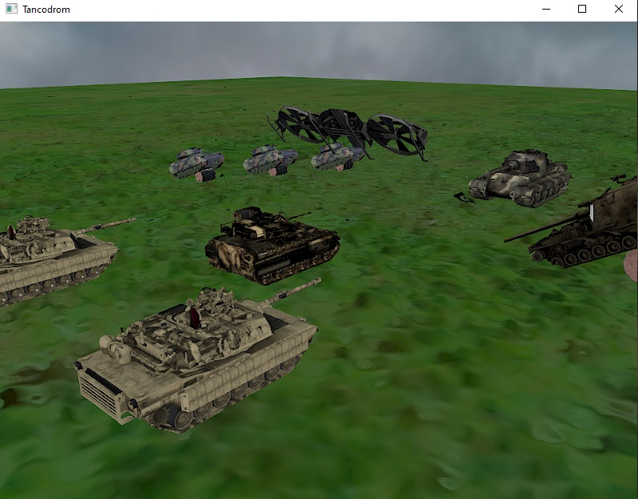
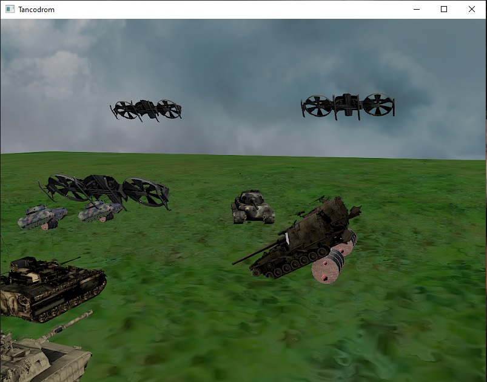

# Tancodrom

- This project is an implementation of a tancodrom in 3D using C++ with OpenGL.
- This project was created as part of the laboratories of 3D Graphic Modeling in C ++ with OpenGL at university.
- Using OpenGL the app loads some 3D objects with an ObjectLoader, such as the tanks, the drones and the ramps.

There is a tank wihch can be moved by the user using the arraw keys. Also, the drones are flying up and down on their own.

